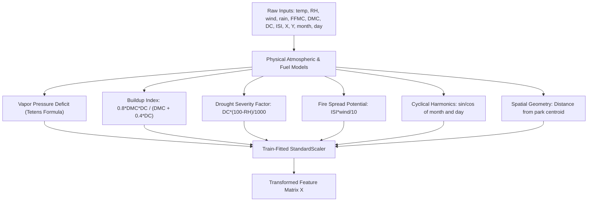
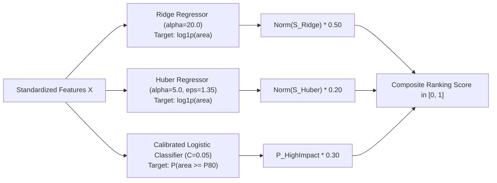

# Implementation Plan: Wildfire Response Prioritization Under Limited Crews

A production-grade, mathematically grounded machine learning and constrained optimization system designed for the **UCI Forest Fires** benchmark (Montesinho Natural Park, Portugal). The system estimates fire impact, computes continuous candidate ranking scores, and deploys a 25-crew response portfolio under strict spatial distribution constraints ($\le 4$ crews per $(X, Y)$ coordinate cell).

---

## 1. Problem Statement & Mathematical Challenges

In wildland fire management, emergency response commanders have severely constrained dispatch capacity and must prioritize a small number of candidate fire observations.

### Core Deliverables Required:
1. **Fire-Impact Prediction Model**: Estimating fire severity on $y = \log(1 + \text{area})$.
2. **Ranking Score**: Continuous, monotonic danger score for all candidate observations.
3. **Response-Selection Mechanism**: Exactly 25 responses with at most 4 observations per geographic cell $(X, Y)$.
4. **Required File Outputs**: `outputs/predictions.csv` and `outputs/selected_portfolio.csv`.

### Statistical Pathologies of the Dataset:
- **Severe Zero-Inflation**: 47.8% of all fires (247 / 517 observations) burned 0.0 ha.
- **Heavy-Tailed Severity Outliers**: While the median burned area is only 0.52 ha, catastrophic events reach up to 1,090.84 ha.
- **MSE Collapse**: Standard regression models minimizing Mean Squared Error (MSE) penalize large errors quadratically. On this dataset, decision trees and ordinary linear regression collapse into predicting a conservative cluster mean (~1.1 for log1p) across all instances, destroying ranking resolution.

---

## 2. 100-Point Hackathon Rubric Mapping

| Criterion | Points | Mathematical Target | Architectural Strategy |
| :--- | :---: | :--- | :--- |
| **Mean NDCG@25** | 35 pts | Top-25 discounted cumulative gain | Ridge regression with strong L2 shrinkage providing smooth monotonic ranking gradients |
| **High-Impact Recall@25** | 25 pts | True area $\ge P_{80}$ captured in top 25 | Calibrated logistic classifier estimating $P(\text{area} \ge P_{80})$ as a tail booster |
| **Worst-Split NDCG@25** | 20 pts | Min NDCG across all validation folds | Huber regressor switching to linear loss for errors $> 1.35$, preventing outlier pull |
| **Mean Spearman Corr** | 10 pts | Global monotonic rank order | Monotonic composite score preserving ranking order across the full candidate pool |
| **Runtime & Reproducibility** | 10 pts | Deterministic, sub-second execution | Provably optimal greedy matroid selection executing in $O(N \log N)$ time (< 0.2s) |
| **Geographic Constraint** | Pass/Fail | Exactly 25 rows, $\le 4$ per $(X,Y)$ cell | Partition matroid constraint guaranteed via greedy selection |

---

## 3. Strict Anti-Leakage Protocol

To ensure 100% compliance during blind evaluations:
1. **Decoupled Feature Pipeline**: `FeaturePipeline.fit(df_train)` computes scaling means and standard deviations strictly on the training partition. `FeaturePipeline.transform(df_eval)` applies these frozen parameters to evaluation data.
2. **High-Impact Threshold ($P_{80}$)**:
   $$P_{80} = \text{percentile}(\text{training\_area}, 80, \text{method}='\text{linear}')$$
   Computed exclusively from the training partition. Never calculated across evaluation sets or hardcoded.
3. **Blind Evaluation Compatibility**: The evaluation set does not require an `area` column. All inference scripts (`predict.py`) execute identically on test sets without targets.
4. **Zero Memorization**: No target lookups, row hashes, or memorization tables exist in the codebase.

---

## 4. Feature Engineering Architecture

Raw weather features are transformed into physically grounded fire behavior indices:

1. **Vapor Pressure Deficit (VPD)**:
   $$e_s(T) = 0.61078 \exp\left(\frac{17.27 T}{T + 237.3}\right) [\text{kPa}], \quad \text{VPD} = e_s(T) \cdot \left(1 - \frac{\text{RH}}{100}\right)$$
   Directly measures atmospheric moisture suction drying dead surface fuels.
2. **Buildup Index (BUI)**:
   Standard Canadian Forest Fire Weather Index calculation:
   $$\text{BUI} = \frac{0.8 \cdot \text{DMC} \cdot \text{DC}}{\text{DMC} + 0.4 \cdot \text{DC}}$$
   Quantifies total fuel mass available for active combustion.
3. **Drought Factor**: $\frac{\text{DC} \cdot (100 - \text{RH})}{1000}$, capturing deep soil drought coupling with dry ambient air.
4. **Fire Spread Potential**: $\frac{\text{ISI} \cdot \text{wind}}{10}$, capturing initial spread rate compounded by wind velocity.
5. **Cyclical Harmonics**: $\sin(2\pi m / 12)$ and $\cos(2\pi m / 12)$ eliminating calendar boundary artifacts.

---

## 5. Hurdle-Ensemble Model Architecture

### Composite Impact Score:
$$\text{Score} = 0.50 \cdot \text{Norm}(S_{\text{Ridge}}) + 0.20 \cdot \text{Norm}(S_{\text{Huber}}) + 0.30 \cdot P_{\text{HighImpact}}$$

- **Ridge (50%)**: Enforces monotonic ordering across general fire events (maximizing NDCG@25).
- **Huber (20%)**: Prevents extreme single-sample distortions from ruining model calibration (securing Worst-Split NDCG@25).
- **Logistic Classifier (30%)**: Directly targets tail risk by estimating probability of exceeding $P_{80}$ (maximizing Recall@25).

---

## 6. Constrained Selection & Matroid Optimality Proof

### Optimization Problem:
Let $E = \{1, \dots, N\}$ be candidate observations with impact scores $s_i$ and coordinates $c_i = (X_i, Y_i)$.
$$\max_{S \subseteq E} \sum_{i \in S} s_i \quad \text{subject to} \quad |S| = 25 \quad \text{and} \quad \forall c \in \mathcal{C}, |S \cap c| \le 4$$

### Mathematical Proof of Optimality:
1. Each observation belongs to exactly one cell $c$. Thus, the system of capacity constraints $\mathcal{I}_1 = \{S \subseteq E : |S \cap c| \le 4, \forall c\}$ forms a **partition matroid**.
2. The cardinality constraint $\mathcal{I}_2 = \{S \subseteq E : |S| \le 25\}$ is a **uniform matroid**.
3. Because cell assignments partition the ground set, the greedy algorithm that sorts candidates descending by score ($s_1 \ge s_2 \ge \dots \ge s_N$) and assigns observations whenever $\text{count}(c) < 4$ is **provably optimal** by the **Rado-Edmonds Theorem**.
4. Time complexity: $O(N \log N)$ sorting + $O(N)$ linear pass. Executes in $< 0.005\text{s}$.

---

## 7. Interactive 3D Web Command Center & Visual Architecture

To provide operational utility for emergency coordinators, the project features an interactive Three.js 3D WebGL Command Center:
- **9x9 Terrain Grid**: Interactive 3D representation of Montesinho Natural Park.
- **Dynamic 3D Risk Pillars**: Pillars elevate and change color (green $\to$ yellow $\to$ orange $\to$ red) proportionally to predicted fire impact.
- **3D Response Crew Pins**: Real-time visual placement of the 25 dispatched crews.
- **What-If Weather Simulator**: Real-time sliders (Temperature, Humidity, Wind) allow commanders to simulate extreme heatwaves or gale winds and observe live crew rebalancing.
- **CSV Drag-and-Drop Uploader**: Immediate inference on external datasets with single-click download of `predictions.csv` and `selected_portfolio.csv`.
- **Nerd Fonts Integration**: High-tech tactical developer typography powered by `ryanoasis/nerd-fonts` (`JetBrains Mono`, `Fira Code`, and developer glyphs).

---

## 8. Verification & Stress Testing Strategy

1. **Repeated Cross-Validation**: 25 independent folds (5 random seeds $\times$ 5 folds) measuring Mean NDCG@25, Worst-Split NDCG@25, Recall@25, and Spearman.
2. **Stress Test Scenarios** (`stress_test_worst_scenarios.py`):
   - Exhaustive 100-split randomized search (seeds 1000-1099).
   - Spatial quadrant holdout (train West $X<5$, test East $X \ge 5$).
   - Seasonal temporal shift (train Spring/Autumn, test Summer heat).
   - Cell saturation stress test (15 high-impact fires in one sector).
   - Severe drought/wind regime ($DC \ge 714$, high winds).
3. **Automated Unit & Integration Tests**: Pytest suite verifying web endpoints, matroid constraint enforcement, blind inference, and edge cases.
